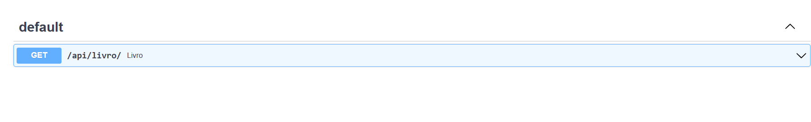

# Iniciando com Django e Django-ninja
    
    ativar venv
    pip install django
    pip install django-ninja

# Criando Projeto

    django-admin startproject rest_api

# Rodando servidor

    python manage.py runserver -> http://127.0.0.1:8000/

# Usando django-ninja

    -> urls.py
    from ninja import NinjaAPI

    api = NinjaAPI()
    @api.get('livro/')
    def livro(request):
        return {'msg': 'Livros'}

    urlpatterns = [
    path('admin/', admin.site.urls),
    path('api/', api.urls)
    ]

# Acessando documentação

    api/docs

# migrando dados

    python manage.py migrate

# Sites para estudo

    https://www.alura.com.br/artigos/django-query-sets-e-orm
    https://django-ninja.rest-framework.com/guides/input/path-params/
    https://docs.djangoproject.com/en/4.2/topics/db/models/
    https://docs.djangoproject.com/en/4.2/topics/db/queries/

